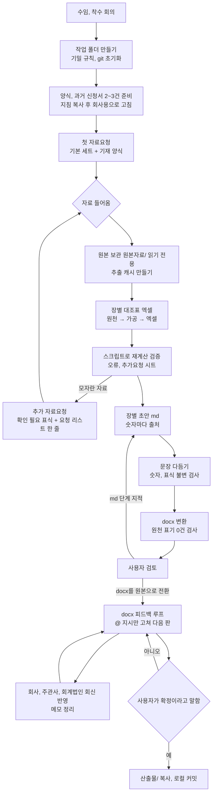

# 01. 착수와 전체 작업 흐름

새 회사의 상장예비심사신청서(코스닥)를 맡았을 때 첫날부터 확정까지 무엇을 어떤 순서로 하는지 정리한 문서다. 회사 이름, 숫자, 사람은 들어 있지 않다. 세부 규칙은 각 번호 문서를 본다.

이 플레이북은 특별한 도구(전용 스킬, 외부 AI 연결, 미리 만든 스크립트)가 없어도 쓸 수 있게 썼다. 사람이 직접 하거나, 일반 AI 도우미(Claude 등)에게 이 문서를 주고 시키면 된다. 자동화가 필요한 곳은 `09_도구_레시피.md`의 짧은 코드 예시를 쓴다.

---

## 1. 한눈에 보는 순서도



순서도 그림(mermaid)이 보이지 않는 편집기에서는 아래 글자 순서도를 보면 된다. 같은 폴더의 `순서도.html`을 브라우저로 열면 그림으로 볼 수 있다.

```
[착수 회의] → [폴더, 규칙 세팅] → [양식, 과거 신청서 준비] → [첫 자료요청]
                                                              │
        ┌──────────────── 모자란 자료: 추가 요청 ◀─────────┐   ▼
        ▼                                                  │ [자료 수령, 추출]
   [자료 수령, 추출] → [대조표 엑셀] → [재계산 검증] ───────┘
                                          │ 맞음
                                          ▼
                        [장별 초안 md] → [문장 다듬기] → [docx 변환]
                                                            │
                                                            ▼
                                                     [사용자 검토]
                                                            │ docx를 원본으로 전환
                                                            ▼
              ┌──▶ [@ 지시만 고쳐 다음 판] → [회사, 외부 회신 반영, 메모 정리] ──┐
              └──────────────────────────────── 다시 검토 ◀──────────────────┘
                                                            │ 「확정」
                                                            ▼
                                                [산출물 보관, 로컬 커밋]
```

글로 쓰면 이렇다.
1. 착수 → 2. 폴더와 규칙 세팅 → 3. 양식과 과거 신청서 준비 → 4. 첫 자료요청 → 5. 자료 수령, 추출 → 6. 대조표와 검증 → 7. 초안 → 8. 문장 다듬기 → 9. docx → 10. 사용자 검토 → 11. docx 피드백 루프(회사, 외부 회신 포함) → 12. 확정.

---

## 2. 착수 첫날 할 일

### 2-1. 사용자에게 먼저 확인할 것 (한 번에 묻는다)
| 항목 | 왜 필요한가 |
|---|---|
| 상장 유형(일반, 기술특례, 성장성 등)과 업종 양식(제조업 등) | 장별 양식과 필수 표가 달라진다 |
| 기준일(최근 사업연도 말, 반기 등)과 비교 연도 | 모든 표의 열이 정해진다 |
| 대표주관회사, 공동주관회사, 외부감사인 | 누가 어느 장을 쓰는지(Ⅸ장은 주관사), 회신 경로 |
| 우리가 맡는 장과 다른 팀이 맡는 장 | 다른 팀 장은 내용을 고치지 않는다 |
| 종속회사 유무(연결 여부), 회계기준(K-IFRS / K-GAAP) | 연결, 별도 표 구분 |
| 회사 담당자와 부서(재무, 인사, 영업, 생산) | 요청 리스트의 담당 열 |
| 최종 산출 형식(docx 합본, 장별 파일 등)과 공유 방식 | 피드백 루프 방식 결정 |
| 기밀 수준(외부 저장소 금지, 개인정보 처리) | 폴더 규칙 |

### 2-2. 작업 폴더 만들기
```
<프로젝트>/
├─ CLAUDE.md            프로젝트 규칙(기밀, 작성 규칙, 폴더 구조)
├─ 원본자료/<회사>/     회사 원본. 읽기만. git 제외
├─ 원본자료/과거회사/   과거 신청서. 구조와 표현만 참고, 내용은 쓰지 않음
├─ 양식/                거래소 신청서 양식(공개 자료)
├─ 지침/                작성 규칙(이 플레이북을 회사용으로 고친 것)
├─ 초안/                장별 md(파일 하나 = 장 하나)
├─ 검토/                대조표 xlsx, scripts/, 검토기록.md, 폴더변경기록.md, docx_이력/, _추출/(git 제외)
└─ 산출물/              사용자가 「확정」이라고 한 것만
```
- 버전 관리를 쓰면 `git init` 후 원본자료, 추출 캐시, docx 이력은 .gitignore에 넣는다. **외부 저장소(GitHub 등)에 올리지 않는다(git push 금지).**
- 파일을 지우지 않는다. 옮기거나 이름을 바꾸면 `검토/폴더변경기록.md`에 적는다.

### 2-3. 지침 세팅
1. 이 플레이북(00~08)을 `지침/`으로 복사한다.
2. 양식 docx에서 장별 목차, 【기재상의 주의】, 필수 표를 뽑아 `지침/장별/`을 만든다.
3. 같은 업종 과거 신청서 2~3건에서 같은 표의 열 구성과 관용 문장을 뽑아 장별 파일에 「구성 참고」로 붙인다.
4. 회사가 정해지지 않은 항목은 `[확인 필요]`로 두고 사용자에게 한 번에 묻는다.

### 2-4. 첫 자료요청
`05_회사자료요청.md`의 「첫 요청 기본 세트」를 회사 사정에 맞게 고쳐 보낸다. 핵심은 **회사가 이미 가진 문서는 파일로, 신청서 표에 값을 적어야 하는 것은 기재 양식 탭으로** 받는 것이다.

---

## 3. 단계별 할 일과 산출물

| 단계 | 하는 일 | 산출물 | 자세히 |
|---|---|---|---|
| 자료 수령 | 원본 보관, 추출 캐시(텍스트, 스캔 그림, 엑셀 숨김 시트까지) | `검토/_추출/` | 02 |
| 대조표 | 원천 → 가공 → 엑셀. 수식 연동 | `검토/대조표_0N_장.xlsx` | 02 |
| 검증 | 스크립트 재계산, 감사보고서와 대조, 오류, 추가요청 시트 | 대조표 「일치」 전부 O | 02 |
| 초안 | 장별 md. 숫자마다 출처. 정형 문단은 관용 문장 | `초안/0N_장.md` | 04, 07 |
| 문장 다듬기 | 숫자 검증 뒤 문장만 다듬기(사람 또는 AI 도구), 전후 숫자 목록 대조 | 다듬은 초안 + 대조 결과 | 04 |
| docx | md → docx 변환, 표 서식, 원천 표기 0건 | 장별 docx 또는 합본 | 03 |
| 사용자 검토 | 사용자가 docx에 @, 메모로 지시 | vDraft-N | 06 |
| 피드백 루프 | @만 고쳐 다음 판, 회사, 외부 회신 반영 | vDraft-(N+1) | 06, 05 |
| 확정 | 사용자가 「확정」이라고 할 때만 | `산출물/` + 로컬 커밋 | 아래 4절 |

### 3-1. 언제 md에서 docx 원본으로 넘어가나
- 처음에는 md가 원본이고 docx는 md에서 만든다.
- **사용자나 회사가 docx를 직접 고치기 시작하면 그때부터 docx가 원본이다.** md에서 다시 구우면 그 수정이 사라진다. 이 전환 시점을 사용자와 명확히 하고, 이후에는 `06_docx_피드백루프.md` 절차만 쓴다.

---

## 4. 확정과 커밋
- 버전 관리(git)를 쓴다면 커밋은 세 시점만: 초안 완성, 문장 다듬기 완료, 확정. 메시지는 「Ⅰ장 초안」처럼 장과 단계만. 쓰지 않는다면 같은 세 시점에 폴더째 날짜를 붙여 보관한다.
- 「확정」 전에는 `산출물/`에 아무것도 넣지 않는다.
- 확정 뒤 고칠 일이 생기면 초안에서 고쳐 다시 확정받고, 옛 확정본은 `산출물/이전/날짜/`로 옮긴다.

## 5. 기록
- `검토/검토기록.md`: 판마다 날짜, 원본 파일, 고친 것, 근거(요청 번호, 메모), 남은 것.
- `검토/폴더변경기록.md`: 만든 파일, 옮긴 파일, 백업 위치.
- 사용자가 새로 정한 규칙은 그날 바로 `지침/`의 해당 문서에 한 줄 추가하고 날짜와 이유를 적는다. 말로만 듣고 넘어가면 다음 판에서 같은 지적을 또 받는다.

## 6. 매 단계 공통 원칙
- 명령을 실행하기 전에 무엇을 하는지 한 줄로 말한다(사용자가 도구에 익숙하지 않을 수 있음).
- 지우기, 되돌리기, 덮어쓰기 전에는 확인을 받는다. 덮어쓸 파일은 먼저 `docx_이력/`에 보관한다.
- 원본에 없는 숫자와 사실은 만들지 않는다.
- 다른 팀이 맡은 장, 사용자가 고친 부분은 건드리지 않는다.
- 결과를 넘기기 전에 칸 단위로 전후를 대조해 의도한 곳만 바뀌었는지 확인한다(08 실수사례 참고).
