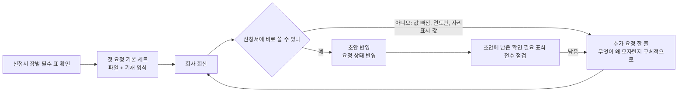

# 05. 회사 자료요청

신청서를 채우는 데 필요한 자료를 회사에 어떻게 요청하고, 회신을 어떻게 받아 반영하는지 정리한 문서다. 회사 부담을 줄이면서도 신청서에 바로 쓸 수 있는 형태로 받는 것이 목표다.

---

## 1. 흐름



```
[필수 표 확인] → [첫 요청(파일+기재 양식)] → [회신] → 바로 쓸 수 있나?
                                                ├─ 예 → [초안 반영, 상태 갱신] → [남은 표식 점검]
                                                └─ 아니오 → [추가 요청 한 줄] → [회신] …
```

---

## 2. 원칙
1. **회사가 이미 가진 문서는 파일로, 신청서 표에 값을 적어야 하는 것은 기재 양식으로** 받는다. 질문을 낱개로 잘게 쪼개 부서별로 수십 줄 늘어놓지 않는다(회사 공수가 너무 커져 회신이 늦어진다).
2. 요청 한 줄에는 **무엇을, 어떤 형식으로, 신청서 어디에 쓰는지**가 들어간다. 예: 「임원 이력에서 연월이 비어 있는 칸(신청서에 노란 ## 표시)을 적어 주세요. 이력서, 졸업증명서로 확인되는 연월(YYYY.MM)이면 됩니다.」
3. **없으면 「없음」으로** 적어 달라고 한다. 「없음」 회신은 신청서에 「해당사항이 없습니다」로 쓴다.
4. 신청서에 남긴 `[확인 필요]`, `##` 하나마다 요청 한 줄이 있어야 한다. 표식과 요청 번호를 서로 찾을 수 있게 한다.
5. 개인정보(주민번호, 자택 주소, 개인 연락처)는 요청하지 않는다. 생년월일은 기재 동의 여부만 묻는다. 회사 자료에 섞여 오면 옮기지 않고 사용자에게 알린다.
6. 회사가 준 값이 다른 자료와 다르면, 어느 쪽이 맞는지 근거 문서(계약서, 등기, 신고서)를 요청한다. 임의로 고르지 않는다.

---

## 3. 첫 요청 기본 세트 (자료가 오기 전)
신청서 장별 필수 표를 채우는 최소 자료다. 회사 사정(업종, 상장 유형, 연결 여부)에 맞게 빼고 더한다. Ⅳ장(사업의 내용)을 다른 팀이 맡으면 사업, 연구개발 줄은 그 팀과 나눠, 같은 자료를 회사에 두 번 요청하지 않게 한다.

| 분야 | 자료 | 신청서 |
|---|---|---|
| 법인 일반 | 정관(최신), 법인등기부등본(말소사항 포함), 사업자등록증, 주주명부(기준일별) | Ⅰ, Ⅶ |
| 재무 | 감사보고서 최근 3개년, 최근 반기, 분기 검토보고서, 결산 정산표, 계정별원장, 주요 계정 명세서 | Ⅴ, Ⅵ |
| 자본 | 설립 이후 자본금 변동 내역(증자, 감자, 양수도 모두, 단가 포함), 주식매수선택권, 전환사채, 신주인수권, 종류주식 조건, 투자계약서 | Ⅰ, Ⅶ |
| 조직, 인사 | 조직도, 임원 이력서(학력, 경력 연월), 겸직 현황, 종업원 현황(부서, 직급, 평균 근속, 급여), 노조 여부 | Ⅱ, Ⅲ |
| 사업 | 제품, 서비스 설명, 시장 자료(외부 보고서), 경쟁사, 매출, 매입 거래처별 실적, 수주 잔고, 생산능력, 가동률, 외주 현황 | Ⅳ |
| 연구개발 | 연구 조직, 인력, 연구비, 과제 목록, 특허, 지식재산 목록 | Ⅳ |
| 인증, 평가 | 기술평가 결과서(기술특례), 벤처, 이노비즈 등 확인서 | Ⅰ, Ⅳ |
| 지배구조 | 관계회사 목록과 재무제표, 이해관계자 거래 내역, 이사회, 주총 의사록, 이사회 규정, 내부회계관리규정 | Ⅲ, Ⅶ |
| 우발, 계약 | 소송, 담보, 보증, 주요 계약서(판매, 구매, 기술, 라이선스, 임대차) | Ⅴ |
| 상장 준비 | 명의개서대행 계약, 공시 담당 조직, 거래소 교육 수료 계획 | Ⅰ, Ⅲ |

---

## 4. 요청 리스트 파일

### 4-1. 회사에 보내는 파일(한 파일)
- 「안내」 탭: 회신 방법, 마감, 담당자, 「없으면 없음으로」.
- 「목록」 탭: 요청 한 건이 한 줄. 열은 아래 7개를 기본으로 한다.

| 열 | 내용 |
|---|---|
| 요청번호 | A-001부터. 지우거나 재사용하지 않고 계속 이어 붙인다 |
| 확보상태 | 미확보 / 확보 |
| 해당 章 | Ⅰ~Ⅷ(여러 장이면 「Ⅰ / Ⅶ」) |
| 요청자료명 | 무엇을, 어떤 형식으로, 신청서 어디에(위 원칙 2) |
| 요청일 | |
| 담당 | 회사 부서 |
| 진행상황 | 회사가 회신 내용을 적는 칸(노란 칸) |

- 「기재-NN」 탭: 신청서에 들어갈 표를 그대로 옮긴 양식. 회사가 채울 칸은 노란색, 우리가 이미 아는 값은 회색(확인만).
- 서식: 맑은 고딕 9pt, 머리행 회색, 줄바꿈 허용, 진행상황 칸 연노랑.

### 4-2. 내부 추적
- 내부용으로 상태(요청전 / 요청 / 수령 / 반영)를 따로 관리하거나, 회사 파일의 확보상태와 진행상황으로 대신한다.
- 장별 대조표 엑셀의 「추가요청」 시트는 작업 중 메모다. 회사에 보낼 때는 요청 리스트로 모은다.

### 4-3. 파일을 고칠 때 지킬 것
- **사용자가 손으로 고친 줄(삭제, 문구 축약)은 그대로 둔다.** 생성 스크립트를 다시 돌려 덮어쓰지 말고 새 줄만 덧붙인다.
- **회사가 쓰는 큰 리스트에 그림, 도형, 메모 칸이 있으면 엑셀 라이브러리(openpyxl 등)로 저장하지 않는다.** 저장하면서 그림이 사라질 수 있다. 이때는 「(00) 회사명_자료요청리스트_추가분_YYMMDD.xlsx」를 따로 만들어 「원본 리스트 마지막 번호 다음에 붙여 넣으세요」라고 안내한다.
- 추가분 파일 이름 앞에 「(00)」을 붙이면 폴더에서 맨 앞에 보인다(사용자가 찾기 쉬움).
- 엑셀이 열려 있으면(잠금 파일 `~$…`) 저장하지 않거나, 사용자에게 「저장하지 말고 닫았다 다시 열라」고 알린다.

---

## 5. 회신 반영

### 5-1. 순서
1. 회신 파일을 받으면 먼저 보관(`docx_이력/`에 날짜 붙여)한다.
2. 이전 판과 행 단위로 비교해 **새로 답이 달린 줄만** 뽑는다.
3. 답을 신청서 위치별로 정리한다(요청번호 → 장 → 표, 문단).
4. 신청서 반영 뒤, 남은 `##`, `[확인 필요]`를 전부 다시 찾아 회신으로 채울 수 있는 것이 더 없는지 본다.
5. 회신으로도 모자란 것만 새 요청으로 만든다.

### 5-2. 회신을 그대로 믿으면 안 되는 경우
| 상황 | 예 | 대응 |
|---|---|---|
| 일부만 답함 | 다섯 건 물었는데 네 건만 답 | 빠진 건만 새 요청 |
| 연도만 있음 | 「1997~2018」 | 신청서는 「1997.##~2018.##」, 월 요청(사용자가 「대충 넣어」라고 허락하면 앞뒤 경력과 모순 없게 정함) |
| 자리표시 값 | 변동표의 양수도 단가가 모두 액면가로 적힘 | 같은 표에서 실제 회신값과 대조, 다르면 계약서나 증권거래세 신고서 요청 |
| 근거가 간접적 | 「같은 라운드 다른 주주 단가와 같음」 | 반영하되 사용자에게 근거가 간접임을 알림 |
| 다른 장과 어긋남 | 약력에 새 겸직이 나왔는데 겸직 표에는 없음 | 겸직 표 반영 여부를 묻는 요청 추가 |
| 날짜가 이상함 | 계약 서명일이 계약기간 시작보다 2년 앞섬, 종료일 2999년 | 문서 그대로 두지 말고 합리적 값으로 쓰되 메모와 요청으로 확인 |

### 5-3. 회사가 신청서 docx에 직접 입력한 경우
- 회사는 새 입력에 빨간 글자나 형광펜을 칠해 둔다. 반영할 때는 내용만 살리고, 사용자가 원하면 표시는 지운다(06 문서 4절).
- 회사가 단 「완료」 메모는 내용 확인 뒤 지운다. 질문이나 확인 요청 메모는 답하기 전까지 남긴다.

---

## 6. 요청 문구 예시(빈칸은 ○○)
- 「신청서 Ⅱ장 임원 현황의 연월이 비어 있는 칸(노란 ## 표시)을 적어 주세요. 이력서, 졸업증명서 기준 YYYY.MM이면 됩니다. 1) ○○ 학사 졸업 연월 2) ○○ 근무 시작, 종료 월」
- 「YYYY.MM.DD 최대주주 ○○ → ○○ 보통주 ○○주 양도의 1주당 거래단가를 적어 주세요(주식양수도계약서 또는 증권거래세 신고서). 신청서 Ⅶ장 최대주주 변동 표에 비어 있습니다.」
- 「경영상 주요계약(판매, 구매, 기술, 라이선스, 임대차) 목록을 적어 주세요. 계약상대방, 체결일, 기간, 계약 내용, 금액. 없으면 「없음」으로 적어 주세요.」
- 「○○ 미수금(반기 말 ○○천원)의 신청서 제출일 현재 회수 여부와 회수일을 알려 주세요.」
- 「제조간접비 배부기준을 적어 주세요(배부 대상 원가 항목, 배부 기준, 제품별 배부 방법). 원가계산 매뉴얼이나 결산 배부표가 있으면 사본이면 됩니다.」

## 7. 점검표
- [ ] 신청서의 `##`, `[확인 필요]` 하나하나에 요청 번호가 있다
- [ ] 요청 문구에 형식(YYYY.MM 등)과 신청서 위치가 있다
- [ ] 「없으면 없음」이 안내에 있다
- [ ] 개인정보를 요청하지 않았다
- [ ] 사용자가 고친 줄을 덮어쓰지 않았다(새 줄만 추가)
- [ ] 그림이 있는 회사 리스트를 라이브러리로 저장하지 않았다
- [ ] 회신 반영 뒤 남은 표식을 전수 점검했다
